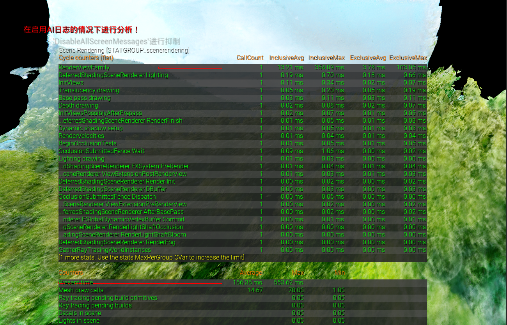
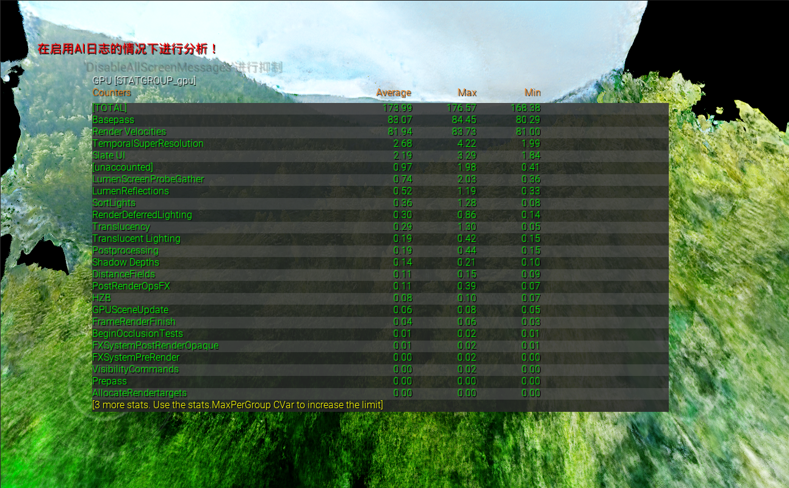
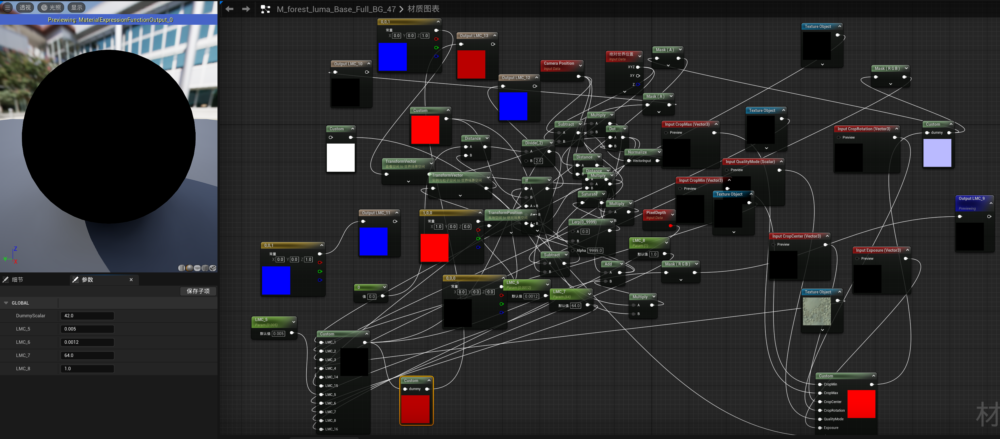
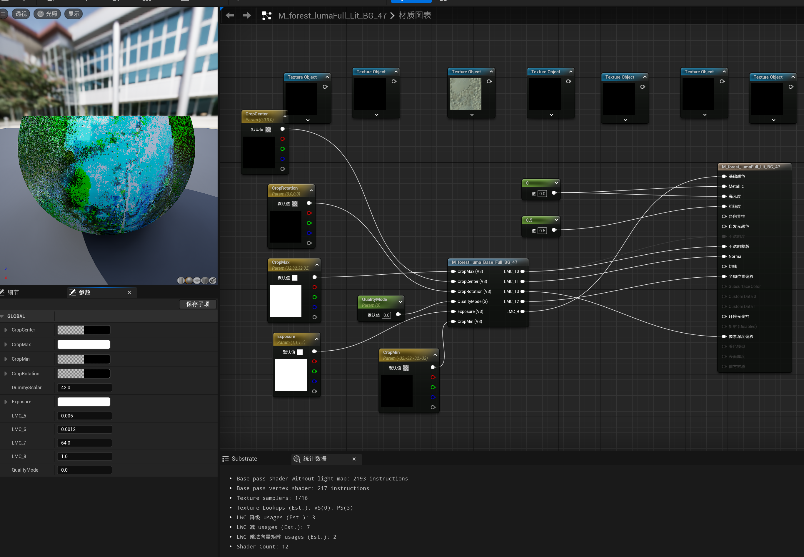
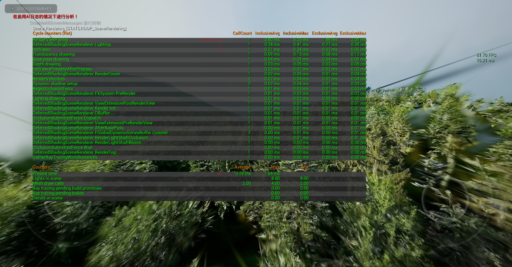
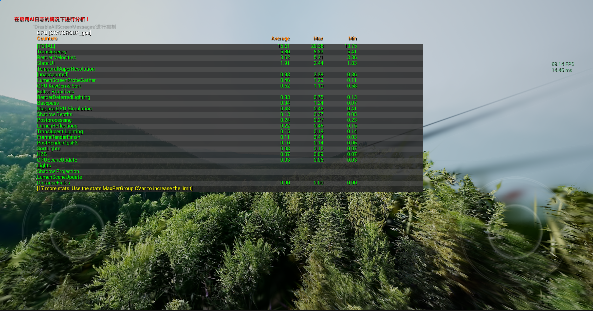

RF Forest
============
实验了一下Radiance Field类方法。首先用视频生成了Luma Field和RF，使用Luma插件导入UE5

Luma Field
---------------

屏占比高的时候帧率急剧下降，5FPS左右（3060），搞的电脑都很卡

GPU bound

估计是shader的问题，看下实现：

场景里用的这个材质PS指令数2193，可能是这里比较重。但材质函数梳理逻辑比较困难（很多节点+一些内嵌HLSL代码），不太好优化

3DGS
------------
体感上类似于把field里的信息在3D空间静态化了（基于Niagara渲染，而Luma Field是GPU driven的static mesh），不用一转视角就得重新跑shader里的raymarch，所以帧数有很大提升，平均帧率接近60，与示例空场景相差不大了，视觉效果整体也比Luma Field好一些（Luma Field比较糊，而且有距离近时物体会融化的问题。3DGS的import速度也比Luma Field快很多）

各项stat数据也与空场景区别不大

插件源码解析
------------
[UE5 Luma NeRF插件源码分析及实测-3A是个坏同志](https://blog.csdn.net/shuangguo121/article/details/150339180?sharetype=blogdetail&sharerId=150339180&sharerefer=PC&sharesource=FYZDMMCpp&spm=1011.2480.3001.8118)
